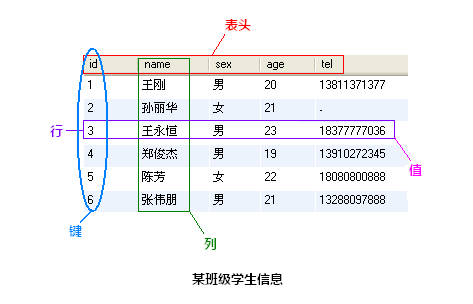

# MySQL 的相关概念介绍

MySQL 为关系型数据库(Relational Database Management System), 这种所谓的"关系型"可以理解为"表格"的概念, 一个关系型数据库由一个或数个表格组成, 如图所示的一个表格:

- 表头(header): 每一列的名称;
- 列(row): 具有相同数据类型的数据的集合;
- 行(col): 每一行用来描述某个人/物的具体信息;
- 值(value): 行的具体信息, 每个值必须与该列的数据类型相同;
- 键(key): 表中用来识别某个特定的人\物的方法, 键的值在当前列中具有唯一性。